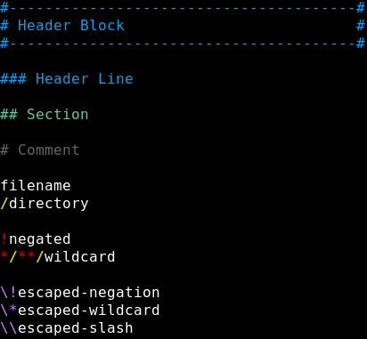

Syntax Highlighting for .gitignore Files in Atom
================================================

Adds syntax highlighting to .gitignore files in Atom.

For full list of supported formats for "Header Blocks", see the [header block samples page](samples-header-blocks.md).

***(Theme used in screenshot: "Oscuro Syntax"...which I have not yet finished but will soon)***
